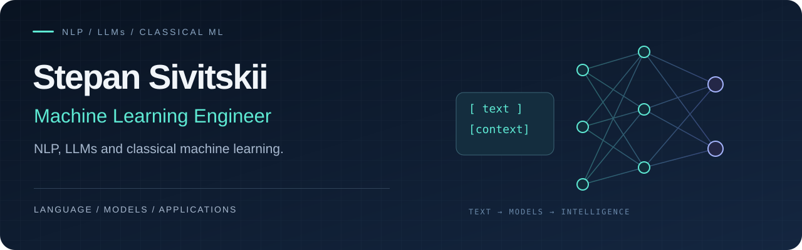

  

**Applied ML · Signal Processing · Recommender Systems · LLM Tools**

[Telegram](https://t.me/ssivitskiy) &nbsp; / &nbsp; [LinkedIn](https://www.linkedin.com/in/ssivitskiy) &nbsp; / &nbsp; [Email](mailto:stepan.sivitsky@yandex.ru)

 

I'm **Stepan**, an ML engineer and Software Engineering student at **ITMO University (2024–2028)**, based in Saint Petersburg. I build applied machine learning projects: from vibration diagnostics and fraud detection to recommendations and LLM-powered developer tools.

My focus is the full path from **data and features → models and evaluation → APIs and usable applications**. A background in C#/.NET helps me connect ML experiments with software engineering.

## Selected ML & AI projects

<table>
<tr>
<td width="50%" valign="top">
01 / SIGNAL PROCESSING
<h3><a href="https://github.com/ssivitskii/VibroLab">⚡ VibroLab</a></h3>

Gearbox and bearing diagnostics from vibration signals. Feature extraction, Random Forest models, browser inference, and an interactive 3D simulator.

<strong>From sensor data to an inspection interface.</strong>

<code>scikit-learn</code> <code>NumPy</code> <code>FastAPI</code> <code>Three.js</code>

<a href="https://github.com/ssivitskii/VibroLab">Explore project →</a>
</td>
<td width="50%" valign="top">
02 / TABULAR MACHINE LEARNING
<h3><a href="https://github.com/ssivitskii/FraudGuard">🛡️ FraudGuard</a></h3>

Fraud detection for payment transactions. Feature engineering, imbalanced classification, model evaluation, and a Streamlit interface.

<strong>Making rare events visible in transaction data.</strong>

<code>Python</code> <code>scikit-learn</code> <code>Streamlit</code> <code>Docker</code>

<a href="https://github.com/ssivitskii/FraudGuard">Explore project →</a>
</td>
</tr>
<tr>
<td width="50%" valign="top">
03 / RECOMMENDER SYSTEMS
<h3><a href="https://github.com/ssivitskii/Movie-Recommender">🎬 Movie Recommender</a></h3>

Hybrid movie recommendations on MovieLens. Collaborative filtering, SVD, and content-based methods with ranking and prediction metrics.

<strong>Turning interaction history into discovery.</strong>

<code>Python</code> <code>SVD</code> <code>MovieLens</code> <code>Streamlit</code>

<a href="https://github.com/ssivitskii/Movie-Recommender">Explore project →</a>
</td>
<td width="50%" valign="top">
04 / LLM APPLICATIONS
<h3><a href="https://github.com/ssivitskii/ai-code-reviewer">🔍 AI Code Reviewer</a></h3>

LLM-assisted code and diff review, with CLI, API, and GitHub Actions integration for developer workflows.

<strong>Bringing language models into everyday tooling.</strong>

<code>Python</code> <code>LLMs</code> <code>REST API</code> <code>GitHub Actions</code>

<a href="https://github.com/ssivitskii/ai-code-reviewer">Explore project →</a>
</td>
</tr>
</table>

## Toolbox

| Area | Technologies & methods |
| :--- | :--- |
| **ML & data** | Python · scikit-learn · NumPy · pandas · Jupyter |
| **Modeling** | Random Forest · Logistic Regression · SVD · Collaborative filtering |
| **Applications** | FastAPI · Streamlit · SQLModel · REST APIs |
| **Engineering** | Docker · GitHub Actions · pytest · Git |
| **Backend foundation** | C# · .NET · ASP.NET Core · PostgreSQL |

## How I approach ML

**Understand the data.** Explore the signal, build meaningful features, and check class balance.

**Evaluate for the task.** Use classification and ranking metrics that reflect the problem, and make evaluation assumptions explicit.

**Build beyond the model.** Connect inference to an API or interface, with tests, documented setup, and reproducible workflows.

<strong>More software engineering projects</strong>

 

- [BankAccountManagement](https://github.com/ssivitskii/BankAccountManagement) — ASP.NET Core API, PostgreSQL, and idempotent transfers.
- [NotificationRoutingService](https://github.com/ssivitskii/NotificationRoutingService) — asynchronous routing, retries, and webhooks.
- [FileFlow](https://github.com/ssivitskii/FileFlow) — file management CLI with dry-run, journaling, and undo.
- [RailwayRouteSimulator](https://github.com/ssivitskii/RailwayRouteSimulator) — deterministic route simulation and analysis.
- [TurnBasedCombatSimulator](https://github.com/ssivitskii/TurnBasedCombatSimulator) — combat simulation, replay, and balance diagnostics.

---

**Let's build something useful with data.**

Open to collaboration on applied ML, intelligent tools, and data-driven applications.

[Get in touch →](https://t.me/ssivitskiy)

